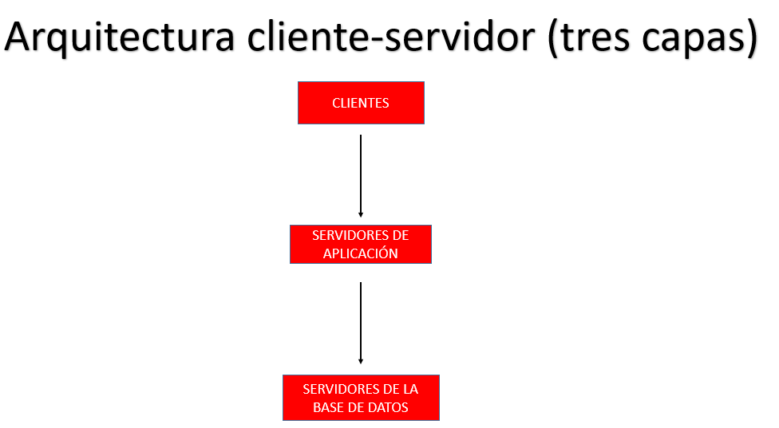
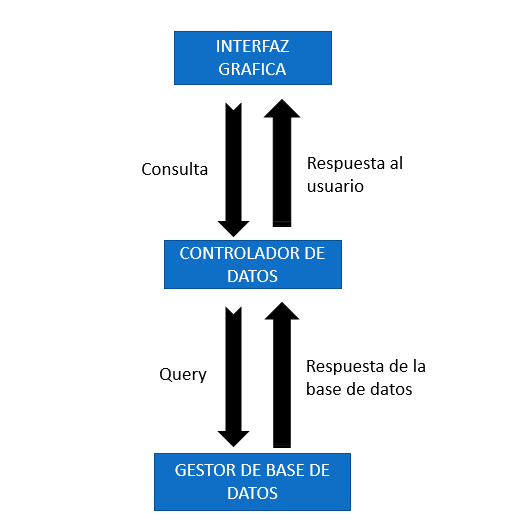
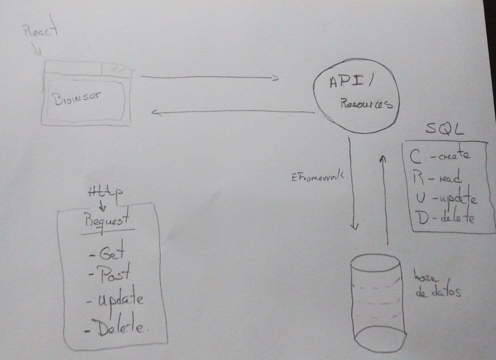
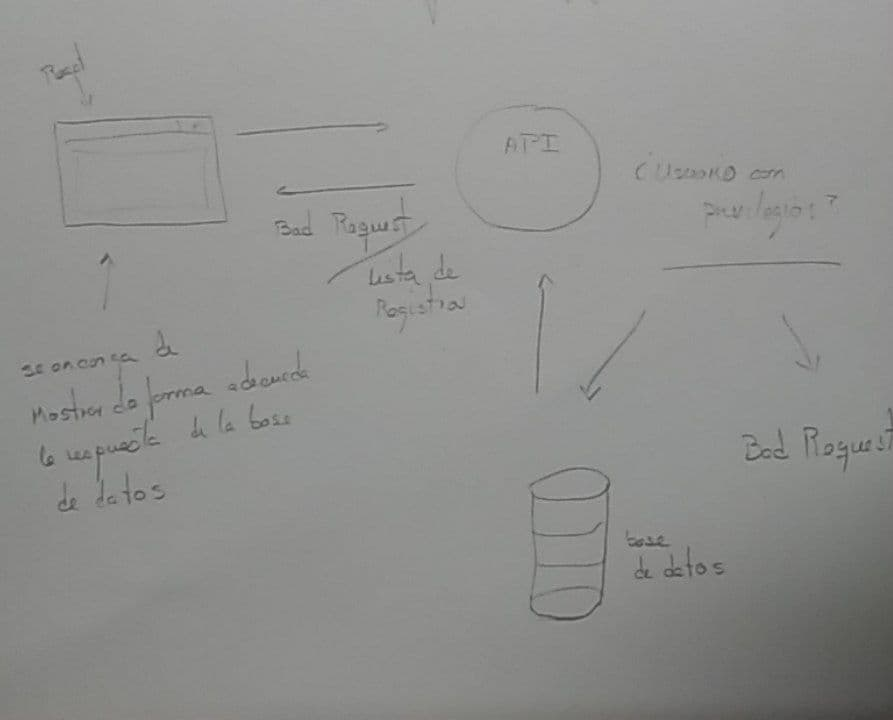

# Informe #2 Diseño de la Aplicación  

### integrantes 

- Daniel de la Cruz Prieto C-311
- Camilo Rodriguez Velázquez C-312
- Frank Adrian Perez Moralez C-311   

El tipo de arquitectura que vamos a utilizar para recompilar la información acerca del comportamiento del **Clash Royale** va a ser la arquitectura Cliente-Servidor N-Capas (tres capas) donde existiran tres tipos de capas:

- **Capa de Presentación:** Esta capa esta destinada al usuario, por lo cual también se le denomina **"Capa de Usuario"**. En esta, el usuario intercambiar\'a con una interfaz gráfica , donde se le presentara el sistema de una manera fácil y entendible de usar, para que este pueda comunicarle a la base de datos toda la información que desea solicitar. Estará representada en el esquema a continuación  por los **Clientes** 

- **Capa de Negocio:** En esta se reciben las peticiones del usuario, a través de la comunicación con la **Capa de Usuario**, se evalúa esta información y se procesa para solicitar al gestor de base de datos el almacenamiento o la recuperación de datos. Luego se comunica nuevamente con la **Capa de Presentacion**  para presentar los resultados adquiridos. En esta capa se consideran los programas de la aplicación. **Servidores de Aplicación**

- **Servidores de la base de datos:**  Es la capa encargada del almacenamiento de los datos y también del acceso a los mismos. En esta se almacenan, recuperan o se reciben a través de la **Capa de Negocio** los datos . **Servidores de Datos**

Como la aplicación que se desarrollara es una pagina web, estas capas tendrán características especificas como en la **Capa de Presentación** que  incluira al servidor web, que es el responsable de presentar los datos en un formato adecuado. En la **Capa de Negocios**, como es la capa de lógica del sistema estara un programa o script el cual sera el encargado de hacer todas las funcionalidades expuestas anteriormente. Por ultimo la **Capa de datos**, se conforma por uno o varios gestores de bases de datos los cuales realizaran las acciones determinadas en esta capa. 

Una aplicación web recogerá los datos del usuario (Primera Capa), los enviar\'a al servidor que ejecutara el programa (Segunda y Tercera Capa) y cuyo resultado sera presentado al usuario en la interfaz Gráfica (Primera Capa nuevamente).

#### Ventajas:

Utilizaremos esta arquitectura para nuestro programa debido a que aporta diversas ventajas a los desarrolladores como:

- Al ser una arquitectura de varias capas, hace mas fácil reemplazar o modificar una capa sin afectar a las otras y sin que los usuarios se vean afectados completamente. Es m\'as sencillo crear diferentes interfaces sobre un mismo sistema sin requerirse cambio alguno en la capa lógica o de datos.

- El acceso a los servicios  es a través de una "interfaz de usuario", por lo que no se necesita que se hagan sesiones de comando remotas directamente en el servicio.

- Se reduce el Acoplamiento Informático y permite la distribución del trabajo por niveles, donde cada grupo de trabajo estará abstraído del resto de los niveles.

- Como cada capa tiene distintos roles, se les confía una misión simple, lo que permite que puedan ampliarse con mayor facilidad en caso de que aumenten las necesidades. 
 
La **desventaja fundamental**  de la arquitectura de Tres Capas es que los servidores pueden sobrecargarse debido al exceso de peticiones hechas por el cliente.

#### Aspectos Generales en el procesamiento de la Formación

 La aplicación deber\'a no solo recompilar datos acerca del **Clash Royale**, también posibilitar\'a al usuario realizar varios tipos de consultas sobre el juego y obtener los resultados de estas. Este tipo de consultas est\'an relacionadas con las estadísticas de los jugadores, cartas, batalla, desafíos, etc... u otros tipos de informaciones las cuales explicaremos en el Manual de Usuario.

  Estas consultas se realizar\'an en la pagina web a través de un "formulario", el cual el usuario completar\'a de  la siguiente manera:
 
#### Ejemplo:

 El usuario desea saber, dado un jugador especifico, a que clanes se puede unir; primero debe rellenar cada uno de los objetos de inter\'es que desee consultar (en este caso seria el jugador y los clanes) a través de la interfaz visual de la pagina web que le ayudar\'a a rellenar cada uno de estos de una manera mas fácil.  Estos campos a rellenar no tendrán carácter obligatorio para poder completar el formulario, pero al menos uno debe rellenarse. 
 
  Luego de que el usuario complete el formulario, este pasara por un controlador que es el encargado de entender que es  lo que se solicita. Tomando el ejemplo en cuestión, el controlador detectar\'a que los objetos a los que tiene que acceder en la base de datos son  los que pertenecen a la información relacionada con los jugadores y a los clanes. Por lo tanto el controlador convertir\'a esta información en un lenguaje  el cual  podrá acceder directamente a la base de datos y obtener los resultados requeridos. 
 
 Pero el resultado que la base de datos entregará no podrá ser la respuesta deseada por el usuario debido a que este, debe ser procesado por el controlador nuevamente para poder conformar una respuesta la cual el usuario podrá entender, en este caso debe devolver todos los clanes que tengan la cantidad de trofeos de entrada menor o igual que la cantidad de trofeos obtenidos por el jugador en cuestión. El proceso se describe de la siguiente manera: 
 

### 3. Esquema de Seguridad 

Como la aplicación va a tener fundamentalmente dos Roles donde cada uno va a tener privilegios específicos de cada uno.

Un rol fundamental es el de Administrador de la Base de Datos (DBA): Este va a ser un usuario que tiene un alto nivel de accesibilidad. Tiene la capacidad de administrar las Base de Datos y los datos de los usuarios. 
Este se encarga de otorgar privilegios y accesos especiales a los usuarios comunes de la aplicación. Por lo tanto va a poder crear nuevas tablas y registros en la base de datos. Ademas de tener el poder de eliminar a cualquier usuario o modificar sus datos 

**Privilegios que tiene el (DBA):**

- Crear Usuarios (comunes y con privilegios de administrador)
- Eliminar usuarios 
- Crear Tablas 
- Borrar Tablas
- Consultar tablas 
- Modificar (borrar , actualizar y añadir  registros )

**Usuarios**

Interactúan con las UI y esta procesa todos los datos para hacer consultas a la aplicación 

**Privilegios de los Usuarios**

- Conectarse a la Base de datos 
- Crear tablas a su esquema de usuarios 
- Crear vistas en su esquema de usuarios 
- Crear secuencias y procedimientos en su esquema de usuarios 

 El siguiente diagrama muestra como funcionaria el flujo de datos de nuestra API 

###### Ejemplo 

El usuario hace un Request a la API. Esta valida que el usuario tanga los privilegios necesarios para
poder acceder a la información que esta pidiendo en el momento que hace el request. Entonces si la aplicación
determina  que el usuario tiene los privilegios requeridos para acceder a este tipo de información entonces se le devuelven los 
resultado de las base de datos. Si el usuario no tiene los privilegios necesarios entonces el server devuelve un "Bad Request". 

Si un usuario quisiera tener información acerca de los 10 mejores usuarios (con mayor cantidad de puntos , ordenados de mayor a menor ) el diagrama messtra como a groso modo se realizaría el flujo de datos para nuestra app 

Vamos a usar Entity Framework para el trabajo con la base de datos y para el mapeo de los datos vamos a utilizar Automapper que es un framework que nos va a facilitar el trabajo en la API el usos de todas estas tecnologías están bien documentadas y están bastante difundidas

#### Funcionalidades de los usuarios y esquema de Navegación 