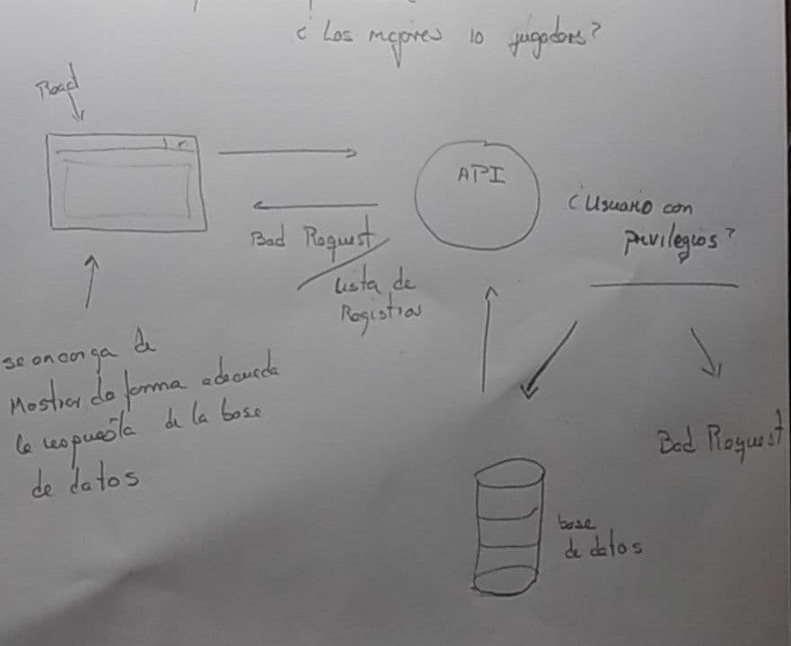
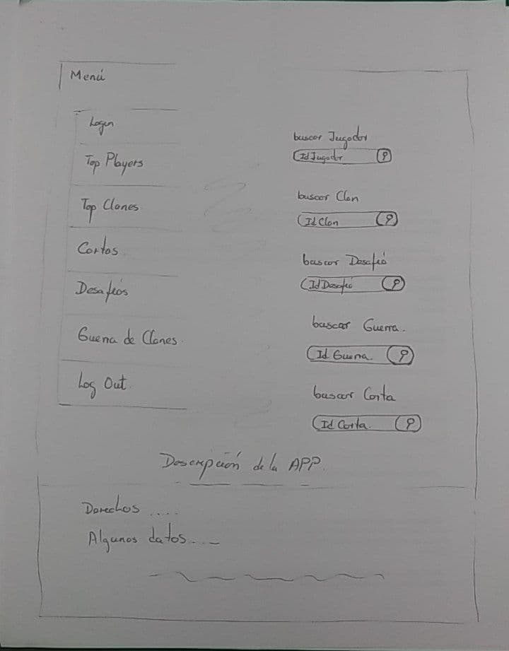

# Informe #2 Diseño de la Aplicación  

### integrantes 

- Daniel de la Cruz Prieto C-311
- Camilo Rodriguez Velázquez C-312
- Frank Adrian Perez Moralez C-311   

El tipo de arquitectura que vamos a utilizar para recompilar la información acerca del comportamiento del **Clash Royale** va a ser la arquitectura Cliente-Servidor N-Capas (tres capas) donde existirán tres tipos de capas:

- **Capa de Presentación:** Esta capa esta destinada al usuario, por lo cual también se le denomina **"Capa de Usuario"**. En esta, el usuario intercambiará con una interfaz gráfica , donde se le presentará el sistema de una manera fácil y entendible de usar, para que este pueda comunicarle a la base de datos toda la información que desea solicitar. Estará representada en el esquema que aparece a continuación  por los **Clientes**.

- **Capa de Negocio:** En esta se reciben las peticiones del usuario, a través de la comunicación con la **Capa de Usuario**, se evalúa esta información y se procesa para solicitar al gestor de base de datos el almacenamiento o la recuperación de datos. Luego se comunica nuevamente con la **Capa de Presentación**  para presentar los resultados adquiridos. En esta capa se consideran los programas de la aplicación. **Servidores de Aplicación**.

- **Servidores de la base de datos:**  Es la capa encargada del almacenamiento de los datos y también del acceso a los mismos. En esta se almacenan, recuperan o se reciben a través de la **Capa de Negocio** los datos . **Servidores de Datos**.

Como la aplicación que se desarrollará es una página web, estas capas tendrán características específicas como en la **Capa de Presentación** que  incluirá al servidor web, que es el responsable de presentar los datos en un formato adecuado, en la **Capa de Negocios**, como es la capa lógica del sistema estará un programa o script el cual será el encargado de hacer todas las funcionalidades expuestas anteriormente. Por último la **Capa de datos**, se conforma por uno o varios gestores de bases de datos los cuales realizarán las acciones determinadas. 

Una aplicación web recogerá los datos del usuario (Primera Capa), los enviará al servidor que ejecutará el programa (Segunda y Tercera Capa) y cuyo resultado será presentado al usuario en la interfaz Gráfica (Primera Capa nuevamente).

#### Ventajas:

Utilizaremos esta arquitectura para nuestro programa debido a que aporta diversas ventajas a los desarrolladores como:

- Al ser una arquitectura de varias capas, hace mas fácil reemplazar o modificar una capa sin afectar a las otras y sin que los usuarios se vean afectados completamente. Es más sencillo crear diferentes interfaces sobre un mismo sistema sin requerirse cambio alguno en la capa lógica o de datos.

- El acceso a los servicios  es a través de una "interfaz de usuario", por lo que no se necesita que se hagan sesiones de comando remotas directamente en el servicio.

- Se reduce el Acoplamiento Informático y permite la distribución del trabajo por niveles, donde cada grupo de trabajo estará abstraído del resto de los niveles.

- Como cada capa tiene distintos roles, se les confía una misión simple, lo que permite que puedan ampliarse con mayor facilidad en caso de que aumenten las necesidades. 
 
La **desventaja fundamental**  de la arquitectura de Tres Capas es que los servidores pueden sobrecargarse debido al exceso de peticiones hechas por el cliente.

#### Aspectos Generales en el procesamiento de la Formación

 La aplicación deberá no solo recompilar datos acerca del **Clash Royale**, también posibilitará al usuario realizar varios tipos de consultas sobre el juego y obtener los resultados de estas. Este tipo de consultas están relacionadas con las estadísticas de los jugadores, cartas, batalla, desafíos, etc... u otros tipos de informaciones las cuales explicaremos en el Manual de Usuario.

  Estas consultas se realizarán en la página web a través de un "formulario", el cual el usuario completará.
 
#### Ejemplo:

El usuario desea saber, dado un jugador específico, a que clanes se puede unir; primero 
debe rellenar cada uno de los objetos de interés que desee consultar (en este caso sería 
el jugador y los clanes) a través de la interfaz visual de la página web que le ayudará 
a rellenar cada uno de estos de una manera mas fácil.  Algunos de estos campos a rellenar 
no tendrán carácter obligatorio para poder completar el formulario, sin embargo en el 
ejemplo en cuestión es necesario rellenar el campo de jugador para saber a partir de este, 
a cuáles clanes puede unirse. 
 
 

Luego de que el usuario complete el formulario, este pasará por un controlador que es el 
encargado de entender que es  lo que se solicita. Tomando el ejemplo en cuestión, el 
controlador detectará que los objetos a los que tiene que acceder en la base de datos 
son  los que pertenecen a la información relacionada con los jugadores y a los clanes. 
Por lo tanto el controlador verificará esta información para que esta pueda ser procesada por 
las demas capas y tomar las desiciones que correspondan en la aplicación . Estos resultados nuevamente será procesada por el controlador para poder enviar 
una respuesta la cual el usuario podrá entender, en el ejemplo en cuestión debe devolver 
todos los clanes que tengan la cantidad de trofeos de entrada menor o igual que la cantidad 
de trofeos obtenidos por el jugador en cuestión. El proceso se describe de la siguiente 
manera:

 

### 3. Esquema de Seguridad 

La aplicación va a tener dos roles principales 

- Usuario (interacción básica con la App)
- Administrador (mayores privilegios )

El siguiente diagrama muestra como funcionaría el flujo de datos de nuestra API 

###### Ejemplo 

El usuario hace un request a la API. Esta valida que el usuario tenga los privilegios necesarios para
poder acceder a la información que esta pidiendo en el momento que hace el request. Entonces si la aplicación
determina  que el usuario tiene los privilegios requeridos para acceder a este tipo de información entonces se le devuelven los 
resultado de las base de datos. Si el usuario no tiene los privilegios necesarios entonces el server devuelve un "Bad Request". 

Si un usuario quisiera tener información acerca de los 10 mejores usuarios (con mayor cantidad de puntos , ordenados de mayor a menor ) el diagrama muestra como a groso modo se realizaría el flujo de datos para nuestra app 

##### Aspectos Generales y procesamiento de la información 

La aplicación la vamos a desarrollar en C# con NetCore. Como ORM vamos a usar EntityFramework. para el manejo de la 
base de datos para (Crear, Actualizar, Consultar y Borrar registros de la base de datos). 

Para crear la base de datos vamos a usar ***Microsoft SQL Server Management Studio***, por la facilidad que nos brinda 
de forma gráfica al crear la base de datos. (es decir que no vamos a usar la filosofía de *"Code First"* 
para la creación de la misma). 

Es decir para el backend vamos a trabajar con dotnet (C#). Para el desarrollo de la 
aplicación gráfica vamos a usar React.(Es decir para el frontend).

De forma general lo que queremos es  crear una Web API y ponerla en un servidor. para poder acceder desde un navegador 
cualquiera a la aplicación.  

#### Funcionalidades de los usuarios y esquema de Navegación 

La aplicación va a tener fundamentalmente dos Roles donde cada uno va a tener privilegios específicos.

Un rol fundamental es el de Administrador de la Base de Datos (DBA): Este va a ser un usuario que tiene un alto nivel de accesibilidad. Tiene la capacidad de administrar las Base de Datos y los datos de los usuarios. 
Este se encarga de otorgar privilegios y accesos especiales a los usuarios comunes de la aplicación. Por lo tanto va a poder crear nuevas tablas y registros en la base de datos. Además de tener el poder de eliminar a cualquier usuario o modificar sus datos. 

**Privilegios que tiene el (DBA):**

- Crear Usuarios (comunes y con privilegios de administrador)
- Eliminar usuarios 
- Consultar tablas 
- Modificar (borrar , actualizar y añadir  registros )

**Usuarios**

Interactúan con las UI y esta procesa todos los datos para hacer consultas a la aplicación 

**Privilegios de los Usuarios**

- Listar los jugadores que hay en la base de datos. 
- Listar los clanes que hay en la base de datos.
- Poder ver los mejores jugadores y clanes ordenados por cantidad de trofeos obtenidos.
- Poder buscar Jugadores , guerras y clanes por si identificador (o puede ser su nombre).  

Los usuarios comunes de la aplicación van a poder acceder a información útil para el uso de esta 
como es Conocer los mejores jugadores que participan en una guerra, conocer las cartas mas populares dentro de cada clan existente. 

Por ejemplo un usuario común podría conocer si un jugador se podría unir a un clan determinado , sabiendo las restricciones del clan 
para unirse a este. Un usuario común también podría saber cual es la carta mas donada en una región dada. 
Los usuarios con roles de administrador podrían modificar registros de una tabla, así como hacer
consultas que haría cualquier usuario común de la aplicación.

Los usuarios con roles de administradores podrían borrar de la base de datos un usuario 
con todos sus datos almacenados , pero nunca va a poder modificar las base de  datos, 
es decir cambiar el tipo de datos de un campo en un tabla dada, este tipo de acciones 
solo es posible hacerlas desde la actualización de la aplicación que es tarea de los 
programadores y el equipo de trabajo que desarrolla y mantiene la aplicación. 

### Esquema de Navegación

Nuestra aplicación tendrá un menú principal para el cual será el punto de partida 
para navegar por nuestra aplicación. Este Menú principal tendría una serie de aspectos los cuales se describen abajo: 

 - Login 
 - Top Player
 - Top Clanes 
 - Cartas 
 - Desafíos 
 - Guerra de Clanes 
 - Log Out 

Cada uno de estos aspectos serán puentes a otras pantallas que responden a cada uno de los apartados que se describen 
entonces.

En la parte derecha del menú principal aparecerán una serie de barras de búsquedas donde teniendo el Identificador (**id**) de cada uno de los elementos que se describen vamos a poder acceder a datos 
propios de cada apartado, por ejemplo si queremos conocer los datos de un jugador y sabemos el id del mismo podemos poner su id en el campo de búsqueda y automáticamente se nos mostrara otra pantalla donde se van a poder ver todos los 
atributos de un jugador en específico. Los elementos de búsqueda que se van a mostrar en este menú principal, son los siguientes: 

 - Buscar Jugador 
 - Buscar Clan 
 - Buscar Desafío 
 - Buscar Guerra 
 - Buscar Carta 

Este apartado del menú principal se vería de la siguiente manera: 

Entonces una vez estando estando en el menú principal si queremos ver cuales son los mejores jugadores nos desplazamos al apartado de  *Top Player* y damos un click, esto nos va a mostrar otra 
pantalla donde veremos un listado de los 10 mejores jugadores ordenado descendente-mente. Cada uno de los record nos daría la siguiente información: 

   - Nombre del Jugador 
   - Nivel 
   - Cantidad de Trofeos  

Este apartado de Top Jugadores se vería de la siguiente manera: 

 
 

Una vez que estemos en este apartado, se puede saber todos los datos de un jugador en específico si damos click encima de la barra que muestra los datos de este jugador, 
Por ejemplo si damos click encima de la barra que nos muestra los datos de ***Player 1*** la aplicación nos llevaría hasta otro apartado donde se mostrarían todo los datos relacionados con este jugador en específico. 
este apartado que describimos se vería de la siguiente manera: 

 

Desde cada uno de los apartados se podría regresar hacia al apartado anterior. y así sucesivamente hasta el menú principal. 

Lo que se describió anteriormente para poder navegar y ver los ***Top Players***
se puede hacer para cada uno de los elementos que aparecen a la izquierda en el menú principal. 
Es decir para los *'Top Clanes'* , *Cartas* , *Desafíos* y  *Guerra de Clanes*. 

Igual para las búsquedas que aparecen a la derecha en el menú principal. se rellena el campo con los 
datos que requiere la búsqueda y se muestra el apartado correspondiente con los resultados obtenidos mediante la 
consulta a la base de datos.

Conjugando las distintas formas de desplazarse y ver informacion de la base de datos desde la aplicaciones podemos ver los resultados de 
cada una de las consultas que se nos propone. 

Por ejemplo si quesieramos conocer el clan con mejor desempeño durante las guerras por región del mundo, es decir,
por cada región obtener el clan con mayor cantidad de trofeos.
Nos iriamos al apartado de Top Clanes y una ves ahi tendraimos listado los mejores clanes 
ordenados de forma descendente por la cantidad de trofeos obtenidos. 
Ahora si quisieramos saber los mejores clanes de una region en específico (supongamos la región *A*), podriamos escoger que se nos listaran solamente los 
clanes de la region a la cual deseamos conocer en este caso la region *A*. Este ejemplo se vería en nuestra aplicación de la siguiente manera: 

 

Y así podríamos hacer con las demás consultas que se nos proponen en la orden del proyecto.
como son conocer los mejores jugadores que participan en una guerra, etc. 

